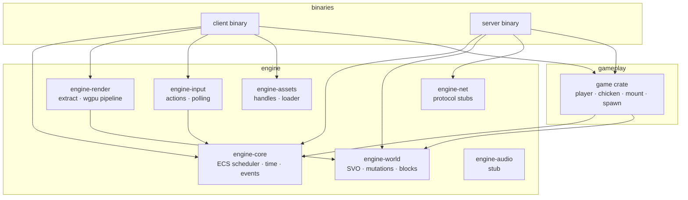

# Chicken Jockey — Implementation Plan

**Status:** Living Document

**Goal:** Build a playable rough prototype — a voxel world you can walk in, break/place blocks, find chickens, mount them, and ride around — on the architecture defined in [`design-doc.md`](./design-doc.md).

**Authority:** [`design-doc.md`](./design-doc.md) defines _how_ we build. This document defines _what_ we build next and in what order.

---

## Target playable loop (MVP)

1. Launch client → flat or procedurally generated terrain appears.
2. WASD + mouse look → move and look around.
3. Left-click breaks voxels; right-click places voxels.
4. Chickens spawn in the world and wander.
5. Interact near a chicken → mount; dismount with a key.
6. While mounted, chicken moves faster with its own steering + player input.

Multiplayer, audio, advanced LOD, and polish are explicitly out of scope until after this loop works locally.

**Current local client:** **Survival** / **Spectator** toggled with **M**; **Tab** cycles debug worlds (**3 blocks** ↔ **rolling hills**). HUD shows mode + world profile + held tool top-left. LMB mines with progress; **1** = hand, **2** = wooden pickaxe. Mobs still deferred (phase 9).

---

## System overview (target state)



---

## Phase tracker

| Phase | Name                         | Status   | Done when                                                                                                                          |
| ----- | ---------------------------- | -------- | ---------------------------------------------------------------------------------------------------------------------------------- |
| 0     | Workspace bootstrap          | Complete | `cargo build` succeeds; crate layout matches design doc §2                                                                         |
| 1     | ECS core + schedule          | Complete | Headless tick loop runs PreUpdate → Update → PostUpdate                                                                            |
| 2     | Client window + clear screen | Complete | Window opens, wgpu clears to a color, closes cleanly                                                                               |
| 3     | Voxel world (minimal SVO)    | Complete | Flat test world queryable; mutations via `WorldMutationQueue`                                                                      |
| 4     | Block registry + data files  | Complete | Blocks defined in JSON/TOML; loaded into `BlockRegistry`                                                                           |
| 5     | Voxel rendering (MVP)        | Complete | Greedy-meshed chunks visible; camera moves through scene                                                                           |
| 6     | Input + player controller    | In progress | Survival mode on local client: WASD, Space jump, gravity, 2-block collider; Spectator via M toggle                               |
| 7     | Block interaction            | Complete | Timed MC mining, wooden pickaxe tool slot (1–9), destroy-stage crack overlay                                                         |
| 8     | Terrain generation           | Complete | Rolling hills: 2D value-noise heightmap, grass/dirt/stone columns, 128×128 radius                                                  |
| 9     | Chickens + mounting          | Deferred | Mob systems unwired; focus on world + spectator camera first                                                                       |
| 10    | Server binary (local)        | Complete | Headless authoritative server; QUIC on `127.0.0.1:4242`                                                                            |
| 11    | Render hardening             | Complete | Extract/render boundary, depth prepass, render-submit thread (surface on main), GPU compute mesh path, screen-space LOD + seam fix |
| 12    | Networking (QUIC)            | Complete | `quinn` transport, bincode protocol, QUIC datagrams for Input/Snapshots, authoritative blocks, client reconciliation               |
| 13    | ECS foundation hardening     | Complete | Run conditions, `GameplayInput` in `game`, `Commands` deferral, no `engine-input` in `game`                                        |
| 14    | Game system refactor         | Complete | Single input resolver, split spawn/plugin registration, shared collision, multiplayer mount lookup                                 |
| 15    | Binary wiring                | Complete | PreUpdate/PostUpdate net+input systems; slim `client/main.rs` winit loop                                                           |
| 16    | Real SVO + async assets      | Complete | Pointer octree with aggregate tests; `AssetServer` + IO thread async block load                                                    |
| 17    | Architecture debt closure    | Complete | `RenderWorld` extract boundary; dead `RenderThread` removed; design-doc dependency graph enforced                                  |
| 18    | MC-parity material engine    | Complete | M0–M7 per [`material-engine.md`](./material-engine.md) |
| 19    | Texture pack importer        | Complete | `import-texture-pack` CLI + [`assets/import/manifest.toml`](../assets/import/manifest.toml) |

Update the **Status** column as work completes. Add dated notes under [Progress log](#progress-log).

---

## Phase details

### Phase 0 — Workspace bootstrap

Create the Cargo workspace and empty crates exactly as specified in design doc §2:

```
crates/engine-core
crates/engine-world
crates/engine-render
crates/engine-net
crates/engine-audio      # empty stub
crates/engine-input
crates/engine-assets
crates/game
client/
server/
```

**Deliverables**

- Root `Cargo.toml` workspace with shared dependency versions (`hecs`, `wgpu`, `winit`, `glam`, `serde`, `bincode`).
- Each crate compiles with a `lib.rs` (or `main.rs` for binaries) and a one-line crate doc comment.
- `client` and `server` binaries print a startup message and exit (or enter an empty loop).

**Constraints:** Enforce dependency rules from design doc §2 from day one. `game` must not depend on `engine-render` or `engine-audio`.

---

### Phase 1 — ECS core + schedule

Implement `engine-core`:

- `hecs` `World` wrapped in an application-owned struct.
- Resource storage (type map or `Resource` trait + insert/get).
- Command buffer for deferred entity/component changes; flush at `PostUpdate`.
- Single-frame event bus (emit/consume, cleared each tick).
- `Schedule` with stages: `PreUpdate`, `Update`, `PostUpdate` (add `Physics`, `Extract`, `Render` later).
- System registration with explicit ordering where needed.

**Deliverables**

- `server` runs a headless loop: fixed timestep, runs schedule, logs tick count.
- At least one test system proves commands and events work.

**Done when:** No game logic outside systems; no global mutable game state.

---

### Phase 2 — Client window + clear screen

Wire `client` binary:

- `winit` event loop on main thread.
- `engine-render` initializes wgpu `Device`/`Queue`/`Surface`.
- Each frame: poll input events, run schedule (empty stages OK), present swapchain.

**Deliverables**

- Window titled "Chicken Jockey".
- Stable 60 FPS clear-color frame (no voxels yet).

**Done when:** Clean shutdown on window close; no wgpu validation errors.

---

### Phase 3 — Voxel world (minimal SVO)

Implement `engine-world` with a **minimal** SVO — not full LOD/Transvoxel yet:

- Fixed leaf size (1 voxel per leaf at max depth).
- Sparse allocation (air = no node).
- Query API: `get_block(pos)`, `is_solid(pos)`, region iteration.
- `WorldMutationQueue` resource: queue `set_block` during `Update`, flush in `PostUpdate` with parent aggregate propagation (even if aggregates are trivial at first).
- Emit `BlockChanged` events on flush.

**Deliverables**

- Startup fills a 64×16×64 flat stone floor + air above (hardcoded in a world-init system for now).
- Unit tests for set/get and queue flush consistency.

**Note:** Full LOD and Transvoxel come in Phase 11. Structure the API now so callers never touch SVO internals.

---

### Phase 4 — Block registry + data files

- `assets/blocks/*.toml` (or JSON) defining block id, name, solid, opaque, texture keys.
- `BlockRegistry` resource loaded at startup via `engine-assets` (sync load acceptable for MVP; async loader stubbed).
- Systems resolve behavior through registry lookups — no magic block IDs in game logic.

**Deliverables**

- At minimum: `air`, `stone`, `dirt`, `grass`.
- Registry hot-reload can wait; loader trait exists.

---

### Phase 5 — Voxel rendering (MVP)

**MVP exception (documented):** Design doc §5.4 targets GPU compute meshing. For this phase only, use **CPU greedy meshing** per chunk to unblock gameplay. Track migration to compute in Phase 11.

Implement in `engine-render`:

- Chunk keys (e.g. 16³) mapped to mesh handles.
- Subscribe to `BlockChanged` → mark dirty chunks → regenerate mesh.
- Basic vertex format: position + normal + UV.
- Simple unlit or flat-lit shader.
- `Camera` component + uniform for view-projection.

**Extract phase (minimal):** Copy camera + visible chunk mesh list into render world each frame. Full render-thread split deferred to Phase 11.

**Deliverables**

- Fly camera (temporary) orbiting or moving through the flat world.
- Meshes update when blocks change.

---

### Phase 6 — Input + player controller

Implement `engine-input`:

- Action map: `MoveForward`, `MoveBack`, `MoveLeft`, `MoveRight`, `Jump`, `Look` (mouse delta).
- Poll in `PreUpdate`; write to `InputState` resource.

Implement in `game`:

- `Player` entity with `Transform`, `Velocity`, `Collider` (AABB), `LocomotionState`.
- `Camera` attached to player (first-person).
- **Minecraft locomotion** (`movement/minecraft.rs`): MCPK horizontal momentum (`0.91` drag + input accel), vertical jump/gravity/drag, sprint-jump boost, 45° strafe multipliers, jump cooldown — constants defined at 20 Hz and scaled to `SIM_DT` (60 Hz) via `scale_mult` / `scale_add_per_tick`.
- Single `player_locomotion_system` on `Stage::Physics` (horizontal velocity → jump → AABB integrate → post-move vertical).
- Spectator fly isolated in `movement/spectator.rs` (frame-delta thrust, not MC physics).

Physics MVP:

- Ground collision via SVO voxel queries (design doc §9).
- No separate terrain collider mesh.

**Deliverables**

- Player spawns above terrain, lands, walks and jumps with MC-faithful airborne momentum.

---

### Phase 7 — Block interaction

In `game`:

- Raycast from camera into SVO (DDA grid traversal).
- `BreakBlock` on left mouse; `PlaceBlock` on right mouse (adjacent empty cell).
- All changes through `WorldMutationQueue`.
- Crosshair overlay deferred; use screen-center ray for now.

**Deliverables**

- Break stone, place stone, see mesh update.

---

### Phase 8 — Terrain generation

Replace flat test floor with procedural terrain:

- `TerrainGen` system runs once at world init (or on chunk demand later).
- Simple 2D heightmap noise → grass top, dirt below, stone deep.
- Bounded world size for MVP (e.g. 256×256 horizontal).

**Deliverables**

- Varied hills; player spawns at safe height.
- Generation runs on main thread for MVP; IO/compute pool later.

---

### Phase 9 — Chickens + mounting

Core game fantasy. All logic in `game` crate.

**Components**

| Component   | Data                      |
| ----------- | ------------------------- |
| `Chicken`   | wander state, speed       |
| `Mountable` | mount offset, rider slot  |
| `Rider`     | reference to mount entity |
| `Mounted`   | reference to rider entity |

**Systems**

- `chicken_spawn_system` — scatter N chickens on grass at startup.
- `chicken_wander_system` — idle random walk, simple obstacle avoidance (ray or voxel step-up).
- `mount_system` — on interact key, if player within range of `Mountable` and no rider, attach `Rider`/`Mounted`, parent player transform to chicken.
- `dismount_system` — interact key while mounted; place player beside chicken.
- `mounted_movement_system` — player input steers chicken; boosted speed.

**Deliverables**

- Ride a chicken across generated terrain.
- Dismount and remount.

**Out of scope for this phase:** Chicken animations, breeding, inventory, combat.

---

### Phase 10 — Server binary (local)

Bring `server` up as headless authority:

- Same `game` systems registered (no render/input systems).
- `engine-net` stub: in-process channel or localhost QUIC (prefer QUIC if Phase 10 net stub is ready).
- Server owns authoritative SVO; client receives block deltas.

**Deliverables**

- `cargo run -p server` + `cargo run -p client` → two processes, one shared world.
- Single player connection works.

**MVP simplification:** Full prediction/reconciliation deferred to Phase 12; client may be dumb for now.

---

### Phase 11 — Render hardening

Align rendering with design doc §5:

- Dedicated render thread; extract snapshot on main, consume on render.
- Depth prepass → opaque → transparent → post → UI pipeline structure (post/UI can be passthrough initially).
- Replace CPU greedy meshing with GPU compute mesh generation.
- SVO-driven LOD selection (screen-space error); Transvoxel seams for LOD boundaries.

**Deliverables**

- No game ECS access from render thread.
- Mesh gen off main thread via compute pool.

---

### Phase 12 — Networking (QUIC)

Full client–server model per design doc §7:

- `quinn` transport; reliable streams for world load, datagrams for movement.
- Protocol version + `bincode` messages in `engine-net`.
- Server tick rate fixed; client prediction + reconciliation for player.
- Game systems emit events; net systems in `client`/`server` translate.

**Deliverables**

- Two clients + one server on LAN.
- Block breaks/places authoritative on server.

---

## Progress log

<!-- Append dated entries as phases complete. Example:
### 2026-06-10 — Phase 0 complete
- Workspace scaffolded, all crates compile.
-->

### 2026-06-10 — Phases 0–9 implemented

- Full Cargo workspace scaffolded per design doc §2.
- ECS scheduler, voxel world, block registry, CPU chunk meshing, wgpu client, and shared `game` systems through chicken mounting.
- Run with `cargo run -p client` (click to capture mouse; WASD, Space, E, mouse look, LMB/RMB blocks).

### 2026-06-10 — Phases 10–12 implemented

- **Phase 10:** `server` runs persistent 60 Hz tick loop with authoritative `game` systems.
- **Phase 11:** Rayon-parallel chunk mesh rebuild, camera-distance LOD culling, `extract_render_scene` snapshot before draw. Dedicated render thread + GPU compute meshing remain future work (macOS requires main-thread surface).
- **Phase 12:** `engine-net` QUIC (`quinn`) + bincode protocol; server broadcasts `BlockDeltas` and `EntitySnapshots`; client reconciles with prediction stub.
- **Multiplayer:** `cargo run -p server` then `CJ_SERVER=127.0.0.1:4242 cargo run -p client`.

### 2026-06-10 — MC-parity material engine (Phase 18)

- `ResolvedFace` + `ResolvedBlockMaterials` replace `PackedBlockTextures` / `BlockMaterialMap`.
- Draw buckets (opaque + cutout), depth prepass + opaque + cutout pipeline passes.
- Grass runtime overlay (`uv2`), `VoxelCell` + `BlockState`, CTM neighbor masks, biome colormap tint, animation tick in shader.
- Spec: [`material-engine.md`](./material-engine.md).

### 2026-06-10 — Texture pack importer (Phase 19)

- `cargo run -p engine-assets --bin import-texture-pack` reads zip/dir packs via manifest.
- Whimscape import: grass (overlay + biome tint), dirt, stone, birch leaves (cutout + foliage colormap).
- Upstream pack archived at `source-packs/whimscape-26.1-r2/` (zip committed; `extracted/` gitignored).

### 2026-06-10 — Folder-based block textures + UV layouts

- Per-block `assets/textures/blocks/{name}/albedo.png` (64×32 `cube_v1` cross-net); runtime pack into 256×256 GPU atlas.
- `UvLayoutId` + `BlockMaterialMap` in `engine-assets`; mesher resolves face UVs by block id + normal.
- Artist spec: `assets/textures/README.md`; template `layouts/cube_v1_template.png`; `cargo run -p engine-assets --bin generate-block-textures`.

### 2026-06-10 — Fixed timestep timing

- `engine-core`: `SIM_HZ`/`SIM_DT`, accumulator on `Time`, `tick_fixed_step()`, `tick_render()` = Extract + Render only.
- Client: `run_client_frame` (PreUpdate once → N fixed sim steps → interpolate → render); look once in PreUpdate; spectator uses `frame_delta`.
- Server: shared `SIM_DT`; design-doc §7.4 documents sim/render/net clocks and subsystem divisors for future circuits.

### 2026-06-10 — Survival mining + tools (Phase 7)

- Block `hardness` / `preferred_tool` / `requires_tool` in `assets/blocks/*.toml`; `ToolRegistry` + `assets/tools/wooden_pickaxe.toml`.
- `block_mining_system`: MC-faithful progress at 60 Hz; hand + pickaxe only (pickaxe mines dirt/grass/stone/leaves).
- Whimscape `destroy_stage_0–9` crack overlay on mined face; wireframe outline hidden while mining.
- Keys **1–9** select held-tool slot; debug HUD shows active tool.

### 2026-06-10 — Design-doc hardening (Phases 13–17)

- **Phase 13:** Scheduler run conditions; `GameplayInput`/`PlayerInputs` in `game`; mount mutations via `Commands`; removed `SimulationMode` and `engine-input` dependency from `game`.
- **Phase 14:** Unified `resolve_input`; split local/network spawn and plugin registration; `collision.rs`; mount uses `NetPlayerId` lookup.
- **Phase 15:** Client/server net+input in `PreUpdate`/`PostUpdate`; `client/main.rs` is winit loop + ECS tick only.
- **Phase 16:** Real pointer-based SVO with aggregate propagation tests; `AssetServer` async block registry load via IO thread.
- **Phase 17:** `RenderWorld` extract snapshot; `RenderSubmitThread` (encode/submit on worker, surface/present on main); `ComputeMesher` GPU path; depth prepass; screen-space LOD + simplified Transvoxel seams; QUIC datagrams for `Input`/`EntitySnapshots`; `BlockChangeIntent` game events.

---

## Explicit MVP shortcuts (must be removed later)

| Shortcut                                  | Phase | Replaced in | Status                                   |
| ----------------------------------------- | ----- | ----------- | ---------------------------------------- |
| CPU greedy meshing                        | 5     | 11          | Removed — GPU compute path + LOD meshing |
| Sync asset load                           | 4     | 16          | Removed — `AssetServer` async IO         |
| Main-thread terrain gen                   | 8     | Later       | Open                                     |
| Extract on main thread (no render thread) | 5     | 11          | Removed — render-submit worker thread    |
| In-process / dumb client networking       | 10    | 12          | Removed — QUIC + datagrams               |

Do not let shortcuts leak into `game` or `engine-world` APIs. Isolate them inside `engine-render` or `client`/`server` wiring.

---

## Suggested first session (Phase 0 + 1)

A single focused session can complete:

1. Scaffold workspace and crates (Phase 0).
2. Implement minimal scheduler + headless server loop (Phase 1).

That produces a compiling repo with a ticking ECS — the foundation everything else attaches to.

---

## Open questions (resolve before Phase 9)

- **Camera while mounted:** third-person chase cam vs first-person on chicken?
- **Chicken count / biome rules:** fixed spawn count vs density-based?
- **World persistence:** needed for MVP or always fresh world?

Record decisions here when made; promote permanent gameplay rules to a future `docs/game-design.md` if needed.
